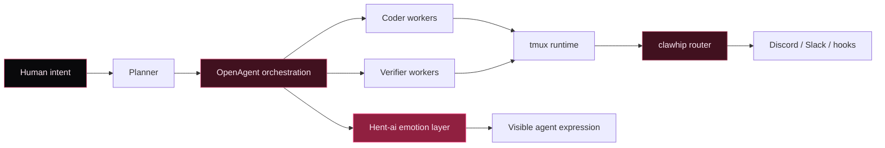

# IYEN

### Agent systems with intent, discipline, and a dangerous amount of personality.

> I build agents that can think, coordinate, report back, and still have a personality.
> The goal is not another chatbot. The goal is a runtime that makes intent visible and turns chaos into verified output.

## Agent mission control

> The control surface refreshes itself from live public repository data every six hours.

## Select a system

<table>
<tr>
<td width="50%" valign="top">

### [◈ Hent-ai](https://github.com/IYENTeam/Hent-ai)

**EMOTION LAYER**

Reads agent responses, detects intent and emotion, then attaches the right character expression through OpenClaw or Hermes.

`intent → emotion → expression`

</td>
<td width="50%" valign="top">

### [⌁ Gajae-Code](https://github.com/IYENTeam/gajae-code)

**CODING HARNESS**

A red-claw coding loop built around deep interviews, resilient planning, tmux-native execution, and durable verification.

`interview → plan → execute → verify`

</td>
</tr>
<tr>
<td width="50%" valign="top">

### [⌁ clawhip](https://github.com/IYENTeam/clawhip)

**EVENT ROUTER**

Daemon-first notification infrastructure with typed events, provider-native hooks, Git/GitHub/tmux sources, and Discord or Slack delivery.

`event → route → deliver → confirm`

</td>
<td width="50%" valign="top">

### [◇ Oh My OpenAgent](https://github.com/IYENTeam/oh-my-openagent)

**ORCHESTRATION CORE**

An opinionated multi-model OpenCode harness with specialist agents, background work, LSP/AST tooling, tmux sessions, and relentless ultrawork loops.

`delegate → parallelize → integrate → finish`

</td>
</tr>
</table>

## Runtime telemetry

<b>Open architecture dossier</b>

 

The pieces are intentionally small. The personality is loud. The handoff is evidence-driven.

## Commit field

`TypeScript` · `Rust` · `Bun` · `Node.js` · `tmux` · `Discord` · `OpenAI` · `Claude`

### Sharp tools. Loud personality. Real output.

